# BeepVision — Smart Assistive Device for Visually Impaired People

<div align="center">

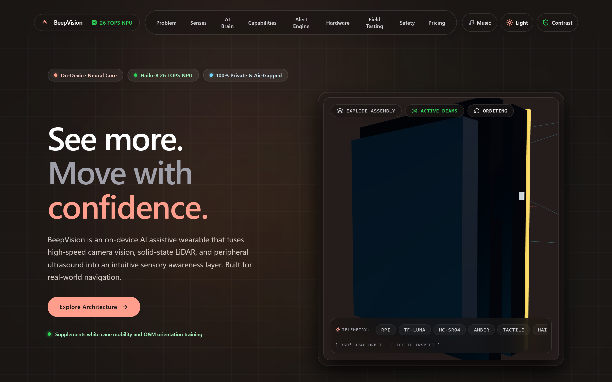

[](https://beepvision.netlify.app)
[](https://vitejs.dev/)
[](https://react.dev/)
[](https://www.typescriptlang.org/)
[](https://tailwindcss.com/)
[](https://threejs.org/)
[](LICENSE)

**"The goal isn't to replace vision. It's to add another layer of awareness."**

*An on-device AI assistive wearable that fuses high-speed camera vision, solid-state LiDAR, and peripheral ultrasound into an intuitive sensory awareness layer.*

🌐 **[Live Demo: beepvision.netlify.app](https://beepvision.netlify.app)**

[Explore Features](#core-features) • [Hardware Architecture](#hardware-architecture) • [Screenshots](#visual-tour--screenshots) • [Getting Started](#getting-started) • [Bill of Materials](#bill-of-materials-bom)

</div>

---

## 👁️ Overview

**BeepVision** is an autonomous assistive wearable designed specifically for visually impaired individuals. Unlike cloud-dependent solutions that suffer from connectivity drops and 2–4 second latency, BeepVision runs **100% on-device** using the **Hailo-8 26 TOPS AI NPU** paired with a Raspberry Pi 5.

It creates an autonomous, private, zero-latency perception layer that supplements traditional white-cane technique and Orientation & Mobility (O&M) training without blocking environmental hearing or compromising user dignity.

```mermaid
flowchart LR
    subgraph Sensors["Multimodal Sensor Array"]
        CAM["Sony IMX219 (RGB 30 FPS)"]
        LIDAR["TF-Luna LiDAR (100 Hz, 8m)"]
        SONAR["4x HC-SR04 Ultrasound (40 kHz)"]
        IMU["MPU-6050 6-DoF IMU (RANSAC)"]
    end

    subgraph EdgeCore["On-Device Edge Compute"]
        RPI["Raspberry Pi 5 (8GB RAM)"]
        NPU["Hailo-8 M.2 (26 TOPS NPU)"]
        YOLO["YOLOv8 Object Detection (.hef)"]
        DEPTH["Monocular Depth Estimation"]
        FUSION["Real-time Spatial Fusion"]
    end

    subgraph Arbitration["Arbitration & Priority Engine"]
        PRIO{"Urgency Metric\nU = f(dist, velocity, class)"}
    end

    subgraph Feedback["Dual-Channel Non-Invasive HMI"]
        AUDIO["Open-Ear Bone Conduction\n(Spatial Voice & Audio)"]
        HAPTIC["4-Zone Directional Haptic Matrix\n(Left / Right / Chest / Back)"]
        BUZZER["Emergency Piezo Buzzer"]
        LED["Safety Amber LED Ring"]
    end

    Sensors --> RPI
    RPI <--> NPU
    NPU --> YOLO & DEPTH
    YOLO & DEPTH --> FUSION
    FUSION --> PRIO
    PRIO --> Feedback
```

---

## ⚡ Core Features

- **🧠 26 TOPS On-Device Neural Processing**: Dedicated Hailo-8 AI NPU runs YOLOv8 and depth models locally at sub-30ms frame-to-feedback response.
- **🛡️ 100% Air-Gapped Privacy**: Zero data leaves the wearable. No cloud dependencies, no internet requirement, functional in subways, basements, and rural dead zones.
- **📡 Multi-Modal Sensor Fusion**:
  - **Sony IMX219 Camera**: 30 FPS object classification (vehicles, pedestrians, stairs, drop-offs, signs).
  - **TF-Luna Solid-State LiDAR**: 100 Hz high-frequency distance ranging up to 8.0 meters.
  - **4-Corner Ultrasonic Array**: Peripheral sonar coverage detecting near-field obstacles outside the camera cone.
  - **MPU-6050 IMU**: Motion compensation using RANSAC ground-plane filtering to cancel body sway during walking.
- **🔊 Open-Ear Bone Conduction**: Transmits directional audio cues directly to temporal bones without obstructing the ear canal, keeping situational ambient hearing 100% intact.
- **📳 4-Zone Directional Haptic Matrix**: Silent, intuitive haptic pulses mapping hazard vectors directly to physical body coordinates.
- **⚡ Hazard Arbitration Matrix**: Intelligent suppression algorithm that silences low-threat static items and prioritizes incoming dynamic hazards (e.g. approaching silent electric vehicles).
- **🔋 All-Day Power Architecture**: Dual 10,000 mAh Li-ion battery setup providing 6–8 hours of nominal continuous inference.

---

## 📸 Visual Tour & Screenshots

### 🌓 Dual Design System (Obsidian Dark & Antimetal Light)

| Dark Mode (Default Obsidian Aesthetic) | Light Mode (Antimetal High-End Engineering Aesthetic) |
| :---: | :---: |
|  | 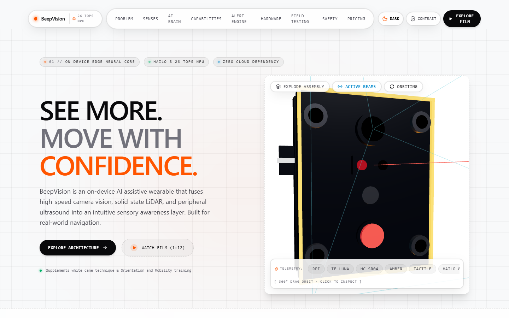 |

---

### 📡 Interactive Sensor Fusion & Spatial Radar

Live interactive spatial radar visualizing LiDAR rays, ultrasonic arcs, and camera classification cones:

| Sensor Fusion Radar | Real-Time Problem Taxonomy |
| :---: | :---: |
| 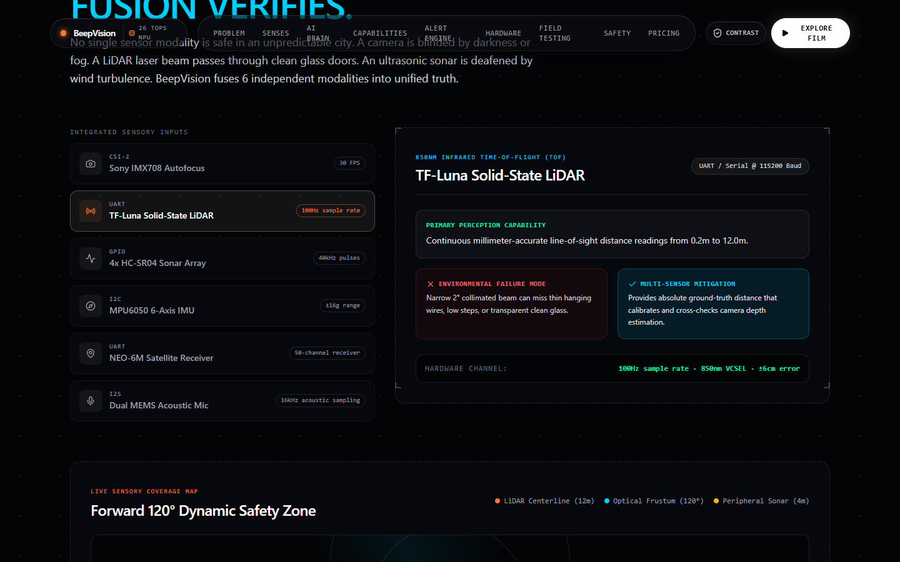 | 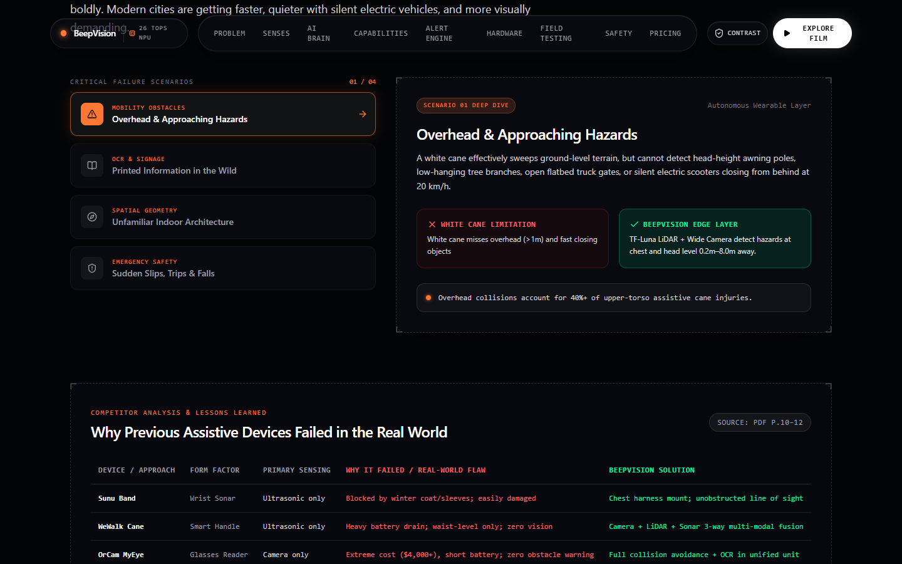 |

---

### ⚡ Neural AI Pipeline & Alert Simulation

Interactive simulator allowing users to test hazard priority arbitration across vehicles, static poles, and drop-offs:

| Hailo-8 AI Brain | Priority Alert Engine |
| :---: | :---: |
| 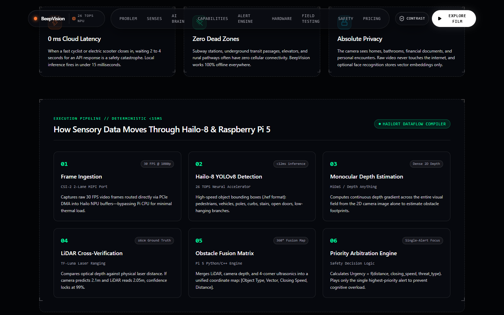 | 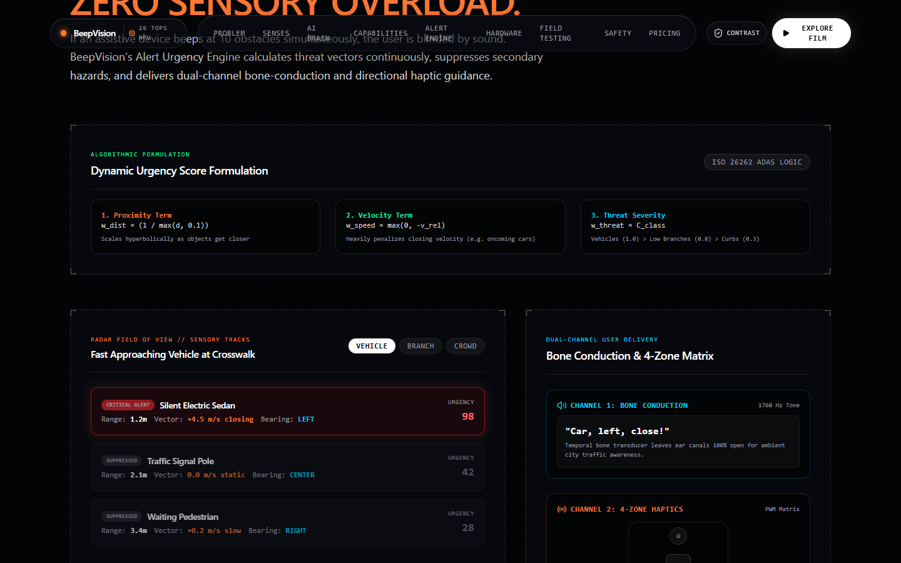 |

---

### 🛠️ Hardware Engineering & Real-World Resilience

| Hardware Specs & Wiring | Real Conditions & Weatherproofing |
| :---: | :---: |
| 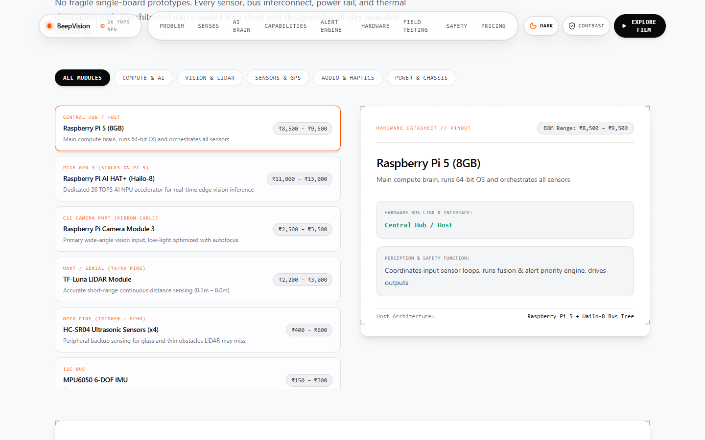 | 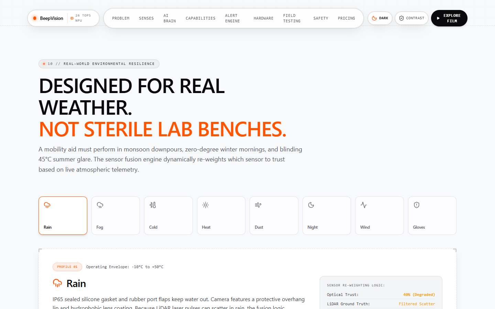 |

---

### 💰 Prototype Cost Breakdown & Engineering Roadmap

Transparent, component-level prototype BOM analysis and transition roadmap from laboratory prototype to custom PCB ASIC:

| Component BOM & Pricing | Strategic Roadmap & Grants |
| :---: | :---: |
| 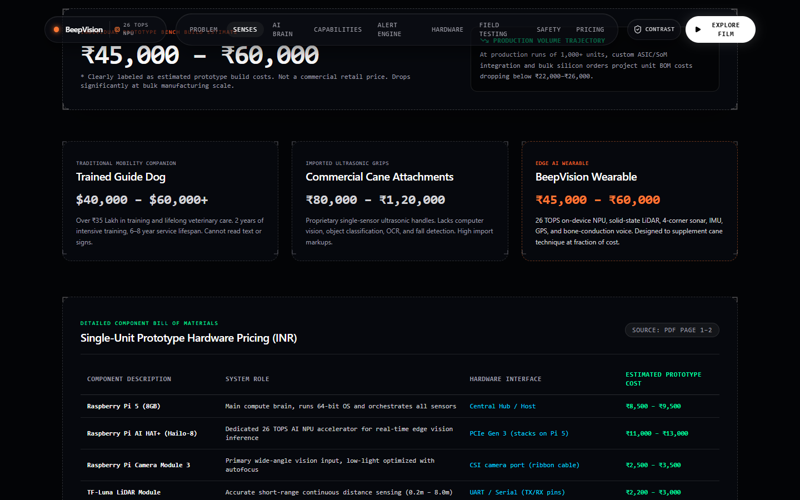 | 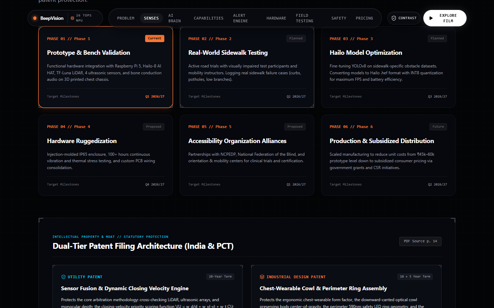 |

---

## 💻 Interactive Website Features

The website accompanying BeepVision is built as a product experience:

- **💎 Dual Theme Engine**: Seamless toggle between deep obsidian dark mode and Antimetal-style technical light mode with persistent storage.
- **🌀 Momentum Scrolling**: Integrated [Lenis](https://lenis.darkroom.engineering/) smooth scroll engine for 60fps momentum feel.
- **🧊 Interactive Three.js 3D Device**: Real-time rendering of the BeepVision chest-harness unit with dynamic rotation, exploded-view breakdown, and technical wireframe modes.
- **♿ AAA Accessibility Mode**: Dedicated one-click high-contrast toggle boosting WCAG contrast and text readability.
- **🧭 Auto-Smooth Navigation**: Intelligent programmatic viewport scrolling with custom reticle styling.

---

## 📋 Bill of Materials (BOM)

### Working Prototype Phase (Current Build)

| Subsystem | Component | Specifications | Est. Cost (INR) |
| :--- | :--- | :--- | :--- |
| **Main Compute** | Raspberry Pi 5 (8GB) | Broadcom BCM2712 Quad-Core Cortex-A76 @ 2.4 GHz | ₹8,500 – ₹10,500 |
| **AI NPU** | Hailo-8 AI HAT+ / M.2 | 26 TOPS Neural Accelerator (PCIe Gen 3.0) | ₹9,500 – ₹12,000 |
| **Primary Vision** | Sony IMX219 / Module 3 | 120° Wide-Angle CSI-2 Camera @ 30 FPS | ₹2,200 – ₹3,500 |
| **LiDAR Ranging** | Benewake TF-Luna | Time-of-Flight LiDAR, 0.2m – 8.0m @ 100 Hz | ₹2,800 – ₹3,800 |
| **Ultrasound** | 4x HC-SR04 Sensors | 40 kHz Transducers (Left, Right, Upper, Lower) | ₹800 – ₹1,200 |
| **Motion Tracking** | MPU-6050 IMU | 6-Axis Gyroscope + Accelerometer (I2C) | ₹350 – ₹500 |
| **Audio Interface** | Open-Ear Bone Conduction | Transducers + PAM8403 / I2S DAC Amp | ₹2,500 – ₹4,000 |
| **Haptic Actuators** | 4x Linear Resonant Actuators | Directional ERM/LRA motors + DRV2605L drivers | ₹1,200 – ₹2,000 |
| **Power System** | 20,000 mAh Li-ion Pack | USB-PD 5V/5A with step-down buck regulators | ₹3,000 – ₹4,500 |
| **Housing & Harness** | Polycarbonate + Ergonomic Straps | 3D Printed PETG enclosure with silicone shock pads | ₹1,500 – ₹2,500 |
| **Hardware Misc** | Wiring, heatsinks, active fan | Connectors, custom cables, thermal dissipation | ₹1,000 – ₹1,500 |
| **TOTAL ESTIMATE** | **Prototype BOM** | **Sub-30ms Full Spatial Awareness System** | **₹37,000 – ₹47,000** (~$440 – $560 USD) |

---

## 🚀 Getting Started

### Prerequisites

- [Node.js](https://nodejs.org/) (v18.0.0 or later recommended)
- `npm` or `pnpm`

### Installation

1. **Clone the repository**:
   ```bash
   git clone https://github.com/ANNIEEONE/beepvision.git
   cd beepvision
   ```

2. **Install dependencies**:
   ```bash
   npm install
   ```

3. **Start the local development server**:
   ```bash
   npm run dev
   ```
   Open `http://localhost:5173` in your browser.

4. **Build for production**:
   ```bash
   npm run build
   ```

5. **Preview production build**:
   ```bash
   npm run preview
   ```

---

## 📂 Project Structure

```
beepvision/
├── screenshots/             # High-resolution screenshots of the UI
├── src/
│   ├── components/
│   │   ├── Navbar.tsx       # Dynamic navigation with theme and accessibility toggles
│   │   ├── Hero.tsx         # Hero section with 3D canvas and technical badges
│   │   ├── Device3D.tsx     # Three.js interactive 3D model with exploded view
│   │   ├── Problem.tsx      # Head-height hazards, silent EVs, competitor comparison
│   │   ├── SensorFusion.tsx # Interactive real-time spatial radar simulation
│   │   ├── BrainAI.tsx      # Hailo-8 NPU pipeline and neural acceleration details
│   │   ├── Capabilities.tsx # Feature matrices and multi-modal sensory cards
│   │   ├── AlertEngine.tsx  # Dynamic hazard arbitration priority simulator
│   │   ├── HardwareSpecs.tsx# Pinout, schematic diagrams, and wiring breakdown
│   │   ├── HowItWorks.tsx   # Step-by-step visual data flow diagram
│   │   ├── DayInLife.tsx    # Contextual real-life accessibility scenarios
│   │   ├── WeatherConditions.tsx # Fog, rain, sunlight, and night operation tests
│   │   ├── SafetyDesign.tsx # Fail-safes, thermal dissipation, and fall detection
│   │   ├── CostBreakdown.tsx# Interactive BOM breakdown with currency toggle
│   │   ├── Roadmap.tsx      # Phase 1 prototype to Phase 4 mass manufacturing
│   │   ├── FinalCTA.tsx     # High-impact summary and closing statement
│   │   ├── Footer.tsx       # Accessible technical footer and contact links
│   │   └── ReticleCorner.tsx# High-end technical corner brackets & badges
│   ├── context/
│   │   └── ThemeContext.tsx # Dual theme provider (Obsidian Dark / Antimetal Light)
│   ├── App.tsx              # Root application container with Lenis momentum scroll
│   ├── main.tsx             # Application entry point
│   └── index.css            # Tailwind CSS v4 styling & custom grid patterns
├── public/                  # Static assets and icons
├── package.json             # Scripts and dependencies
└── vite.config.ts           # Vite build configuration
```

---

## 🛡️ Safety & Engineering Disclaimer

> **Important Safety Note**: BeepVision is engineered as an auxiliary spatial perception device. It is intended to **supplement**, never replace, standard white-cane technique, guide dogs, or formal Orientation and Mobility (O&M) training. Primary ground-level detection (cracks, drop-offs, curbs) remains anchored in mechanical white-cane feedback.

---

## 📄 License

This project is licensed under the [MIT License](LICENSE) — see the LICENSE file for details.

---

<div align="center">
  <sub>Built with passion for accessibility, spatial computing, and on-device edge AI.</sub>
</div>
